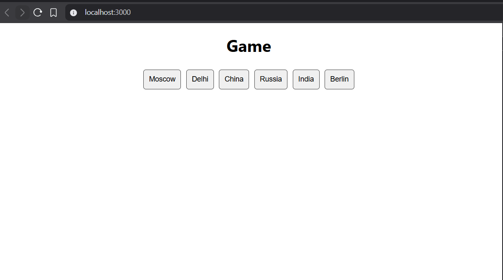

COUNTRY CAPITAL GAME

    FUNCTIONAL REQUIREMENT
    - Implement a component <Game /> that will recieve an Object data as a prop. Each key of the object would be a country 
        and corresponding value would be its capital
    
    const DATA = {
        'India': 'Delhi',
        'Russia': 'Moscow',
        'China': 'Berlin'
    }

    1. Render the list of countries and capitals in the random order on the UI
    2. The aim of the game is to select the country and its capitals.
    3. The user can select 2 options. The default default border color of an option should be #414141.
    4. Selected option should have blue color border.
    5. If the user selection is correct the selected options border color should change to #66cc99 and both options     
        should  disappear from the screen after 1000ms
    6. If the user selection is incorrect/wrong then the selected options border color should change to red and reset after 1000ms
    7. when there is no option left on the screen then show a message CONGRATULATIONS.